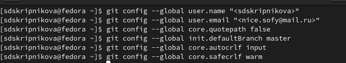
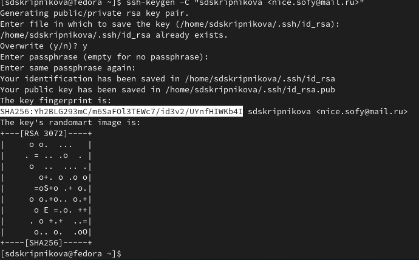
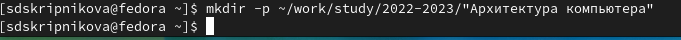
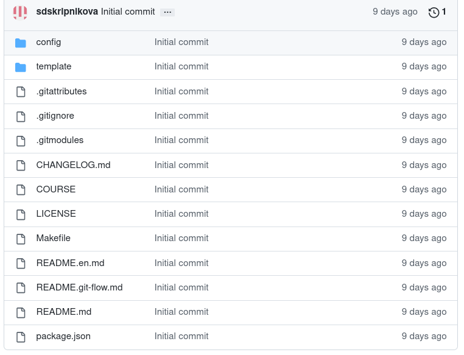
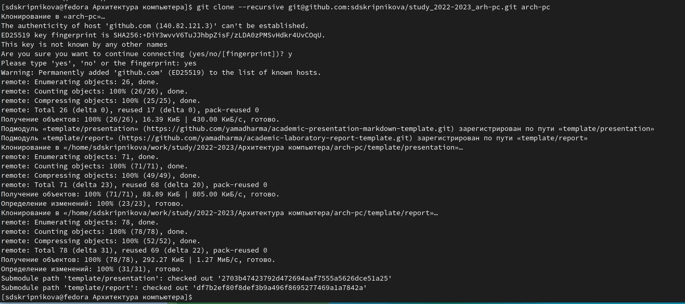
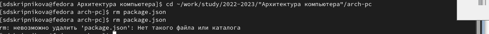
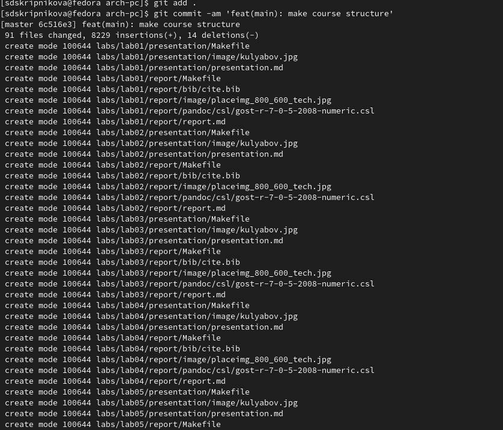

---
## Front matter
title: "Отчет по лабораторной работе № 3"

subtitle: "Дисциплина: Архитектура компьютеров"

author: "Скрипникова София Дмитриевна"

## Generic otions
lang: ru-RU
toc-title: "Содержание"

## Bibliography
bibliography: bib/cite.bib
csl: pandoc/csl/gost-r-7-0-5-2008-numeric.csl

## Pdf output format
toc: true # Table of contents
toc-depth: 2
lof: true # List of figures
lot: true # List of tables
fontsize: 12pt
linestretch: 1.5
papersize: a4
documentclass: scrreprt
## I18n polyglossia
polyglossia-lang:
  name: russian
  options:
	- spelling=modern
	- babelshorthands=true
polyglossia-otherlangs:
  name: english
## I18n babel
babel-lang: russian
babel-otherlangs: english
## Fonts
mainfont: PT Serif
romanfont: PT Serif
sansfont: PT Sans
monofont: PT Mono
mainfontoptions: Ligatures=TeX
romanfontoptions: Ligatures=TeX
sansfontoptions: Ligatures=TeX,Scale=MatchLowercase
monofontoptions: Scale=MatchLowercase,Scale=0.9
## Biblatex
biblatex: true
biblio-style: "gost-numeric"
biblatexoptions:
  - parentracker=true
  - backend=biber
  - hyperref=auto
  - language=auto
  - autolang=other*
  - citestyle=gost-numeric
## Pandoc-crossref LaTeX customization
figureTitle: "Рис."
tableTitle: "Таблица"
listingTitle: "Листинг"
lofTitle: "Список иллюстраций"
lotTitle: "Список таблиц"
lolTitle: "Листинги"
## Misc options
indent: true
header-includes:
  - \usepackage{indentfirst}
  - \usepackage{float} # keep figures where there are in the text
  - \floatplacement{figure}{H} # keep figures where there are in the text
---

# Цель работы

Изучить идеологию и применение средств контроля версий. Приобрести практические навыки по работе с системой git. 

# Выполнение лабораторной работы

1. Создала учетную запись на сайте Github, заполнила основные данные.

2. Создала предварительную конфигурацию git.: (рис. [-@fig:001])

{ #fig:001 width=70% }

3. Генерирование ключей (рис. [-@fig:002])

{ #fig:002 width=70% }

4. С помощью команды cat скопировала из локальной консоли ключ в буфер обмена и вставила его в появившееся на сайте поле. Указала для ключа имя и создала его. (рис. [-@fig:003])

{ #fig:003 width=70%,}

5. Создала каталог для предмета «Архитектура компьютера».(рис. [-@fig:005])

{ #fig:005 width=70% }

6. Перешла на страницу репозитория курса с шаблоном курса, задала имя репозитория и создала его. (рис. [-@fig:007])

{ #fig:007 width=70% }

7. Клонировала созданный репозиторий (рис. [-@fig:009], рис. [-@fig:010],)

{ #fig:008 width=70% }

{ #fig:009 width=70% }

8. Загрузила файлы на Github.(рис. [-@fig:010], рис. [-@fig:011], рис. [-@fig:012]

{ #fig:010 width=70% }

9. Перешла в каталог курса и удалила лишние файлы.(рис. [-@fig:011])
{ #fig:011 width=70% }

10. Отправила файлы на сервер (рис. [-@fig:012])
{ #fig:012 width=70% }

# Выводы

Я ознакомилась с системой контроля версий GIT. Создала репозиторий из шаблона сервиса GitHub и внесла в него необходимые изменения. Я освоила базовые команды утилита git.

