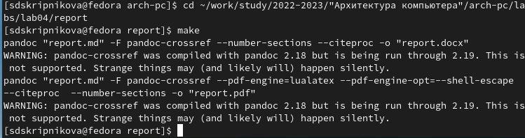

---
## Front matter
title: "Отчет по лабораторной работе № 4"

subtitle: "Дисциплина: Архитектура компьютеров"

author: "Скрипникова София Дмитриевна"

## Generic otions
lang: ru-RU
toc-title: "Содержание"

## Bibliography
bibliography: bib/cite.bib
csl: pandoc/csl/gost-r-7-0-5-2008-numeric.csl

## Pdf output format
toc: true # Table of contents
toc-depth: 2
lof: true # List of figures
lot: true # List of tables
fontsize: 12pt
linestretch: 1.5
papersize: a4
documentclass: scrreprt
## I18n polyglossia
polyglossia-lang:
  name: russian
  options:
	- spelling=modern
	- babelshorthands=true
polyglossia-otherlangs:
  name: english
## I18n babel
babel-lang: russian
babel-otherlangs: english
## Fonts
mainfont: PT Serif
romanfont: PT Serif
sansfont: PT Sans
monofont: PT Mono
mainfontoptions: Ligatures=TeX
romanfontoptions: Ligatures=TeX
sansfontoptions: Ligatures=TeX,Scale=MatchLowercase
monofontoptions: Scale=MatchLowercase,Scale=0.9
## Biblatex
biblatex: true
biblio-style: "gost-numeric"
biblatexoptions:
  - parentracker=true
  - backend=biber
  - hyperref=auto
  - language=auto
  - autolang=other*
  - citestyle=gost-numeric
## Pandoc-crossref LaTeX customization
figureTitle: "Рис."
tableTitle: "Таблица"
listingTitle: "Листинг"
lofTitle: "Список иллюстраций"
lotTitle: "Список таблиц"
lolTitle: "Листинги"
## Misc options
indent: true
header-includes:
  - \usepackage{indentfirst}
  - \usepackage{float} # keep figures where there are in the text
  - \floatplacement{figure}{H} # keep figures where there are in the text
---

# Цель работы
Целью работы является освоение процедуры оформления отчетов с помощью
легковесного языка разметки Markdown.

# Задание

Изучить легковестный язык разметки Markdown

# Теоретическое введение

Чтобы создать заголовок, используйте знак #, например: #This is heading 1

Чтобы задать для текста полужирное начертание, заключите его в двойные

звездочки: This text is **bold**

Чтобы задать для текста курсивное начертание, заключите его в одинарные

звездочки:

This text is *italic*.

Чтобы задать для текста полужирное и курсивное начертание, заключите его

в тройные звездочки: ***labs***

# Выполнение лабораторной работы

1. Я открыла терминал

2. Перешла в каталог курса сформированный при выполнении лабораторной работы No3 и обновила локальный репозиторий: (рис. [-@fig:001])

{ #fig:001 width=70% }

3. Перешла в каталог с шаблоном отчета по лабораторной работе No 4 (рис. [-@fig:002])

{ #fig:002 width=70% }

4. Провела компиляцию шаблона с использованием Makefile. (рис. [-@fig:003], рис. [-@fig:004])

{ #fig:003 width=70%,}

Сгенерировались файлы report.pdf и report.docx.

{ #fig:004 width=70% }

5. Удалила полученный файлы с использованием Makefile. (рис. [-@fig:005],рис. [-@fig:006], )

{ #fig:005 width=70% }

{ #fig:006 width=70% } 
6. Открыла редактор (рис. [-@fig:006])
! [Ввела команду gedit report.md](image/07.PNG) { #fig:006 width=70% } 

7. Заполнила отчет и скомпилировала отчет с использованием Makefile. (рис. [-@fig:009], рис. [-@fig:010],)

{ #fig:008 width=70% }
{ #fig:009 width=70% }

8. Загрузила файлы на Github.(рис. [-@fig:010], рис. [-@fig:011], рис. [-@fig:012]

{ #fig:011 width=70% }

{ #fig:012 width=70% }
# Выводы
Научилась заполнять отчет с помощью легковесного языка разметки Markdown

