---
## Front matter
title: "ОТЧЕТ ПО ЛАБОРАТОРНОЙ РАБОТЕ №6"
subtitle: "Дисциплина: Архитектура компьютера"
author: "Скрипникова София Дмитриевна"

## Generic otions
lang: ru-RU
toc-title: "Содержание"

## Bibliography
bibliography: bib/cite.bib
csl: pandoc/csl/gost-r-7-0-5-2008-numeric.csl

## Pdf output format
toc: true # Table of contents
toc-depth: 2
lof: true # List of figures
lot: true # List of tables
fontsize: 12pt
linestretch: 1.5
papersize: a4
documentclass: scrreprt
## I18n polyglossia
polyglossia-lang:
  name: russian
  options:
	- spelling=modern
	- babelshorthands=true
polyglossia-otherlangs:
  name: english
## I18n babel
babel-lang: russian
babel-otherlangs: english
## Fonts
mainfont: PT Serif
romanfont: PT Serif
sansfont: PT Sans
monofont: PT Mono
mainfontoptions: Ligatures=TeX
romanfontoptions: Ligatures=TeX
sansfontoptions: Ligatures=TeX,Scale=MatchLowercase
monofontoptions: Scale=MatchLowercase,Scale=0.9
## Biblatex
biblatex: true
biblio-style: "gost-numeric"
biblatexoptions:
  - parentracker=true
  - backend=biber
  - hyperref=auto
  - language=auto
  - autolang=other*
  - citestyle=gost-numeric
## Pandoc-crossref LaTeX customization
figureTitle: "Рис."
tableTitle: "Таблица"
listingTitle: "Листинг"
lofTitle: "Список иллюстраций"
lotTitle: "Список таблиц"
lolTitle: "Листинги"
## Misc options
indent: true
header-includes:
  - \usepackage{indentfirst}
  - \usepackage{float} # keep figures where there are in the text
  - \floatplacement{figure}{H} # keep figures where there are in the text
---

# Цель работы

Приобрести практические навыки работы в Midnight Commander. Освоить инструкции языка ассемблера mov и int.

# Задание

Освоить языки ассемблера mov и int и приобрести практические навыки работы в Midnight Commander.

# Теоретическое введение

**Midnight Commander** - это программа, которая позволяет просматривать структуру каталогов и выполнять основные операции по управлению файлов системой. Midnight Commander позволяет сделать работу с файлами более удобной и наглядной.

Программа на языке ассемблера NASM состоит из трех секций: кода программы, инициированных данных, неинициализированных данных.

# Выполнение лабораторной работы

1. Открыла Midnight Commander. (рис. [-@fig:001])

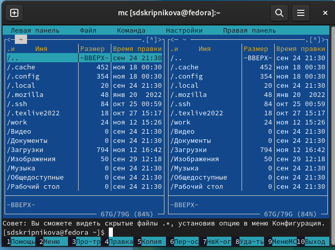{ #fig:001 width=70% }

2. Перешла в нужный каталог и создала папку lab06. (рис. [-@fig:002]; рис. [-@fig:003])

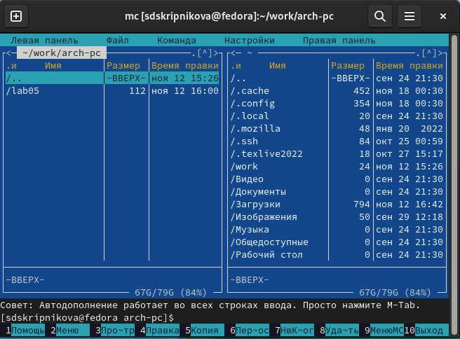{ #fig:002 width=70% }
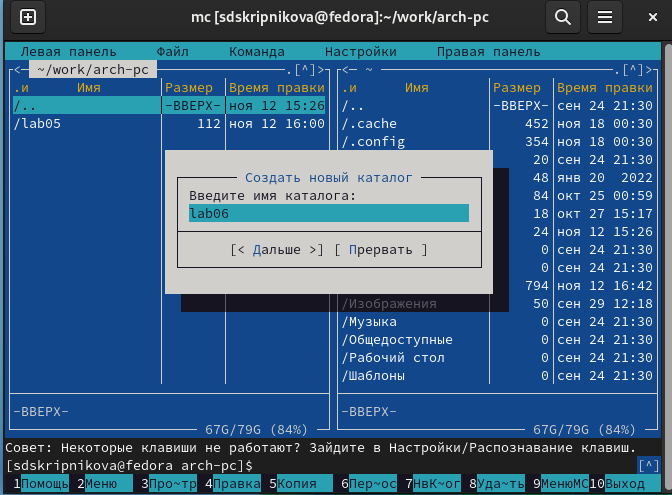{ #fig:003 width=70% }

3. С помощью команды touch создала файл lab6.asm(lab6-1.asm). (рис. [-@fig:004])

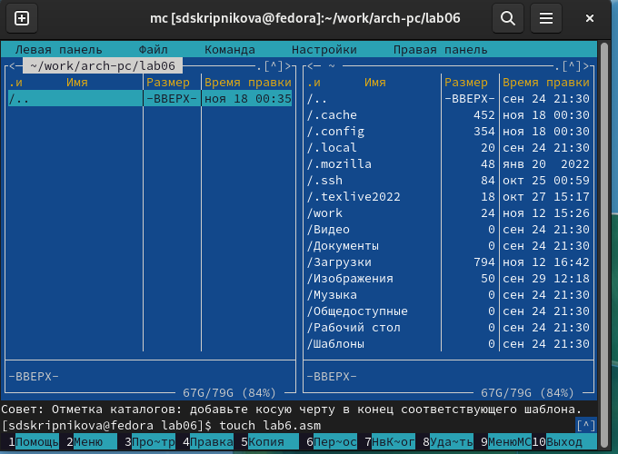{ #fig:004 width=70% }

4. С помощью функциональной клавиши открыла файл lab6.asm (lab6-1.asm). (рис. [-@fig:005])

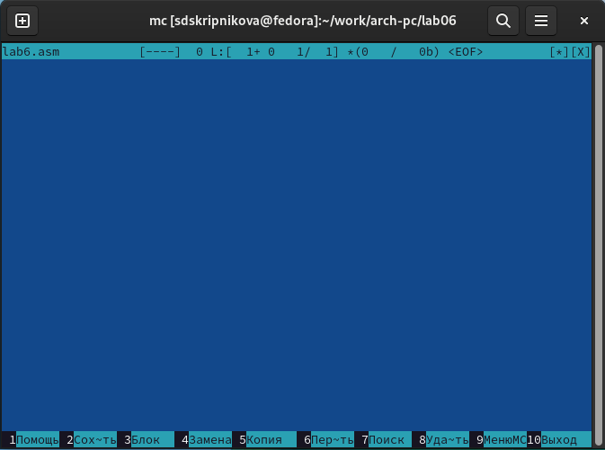{ #fig:005 width=70% }

5. Ввела текст программы из листинга 6.1 и сохранила изменения. Затем с помощью функциональной клавиши открыла данный файл для просмотра. (рис. [-@fig:006])

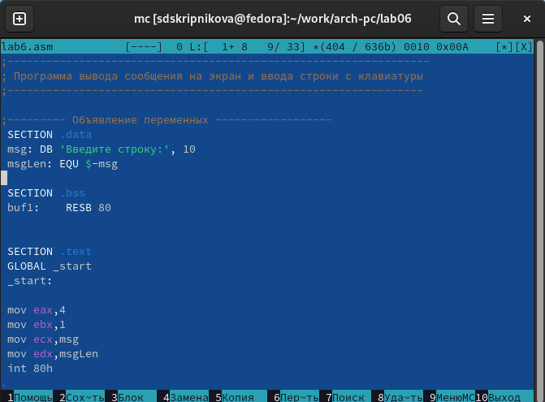{ #fig:006 width=70% }

6. Оттранслировала текст программы lab6-1.asm в объектный файл, выполнила компановку и запустила его. (рис. [-@fig:006]; рис. [-@fig:007]; рис. [-@fig:008])

{ #fig:006 width=70% }
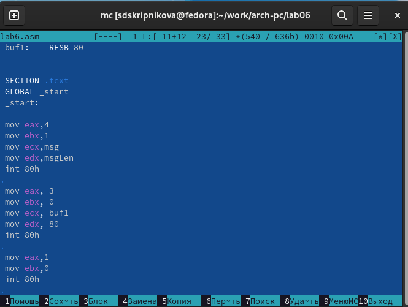{ #fig:007 width=70% }
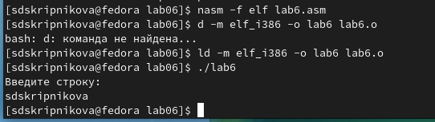{ #fig:008 width=70% }

## Подключение внешнего файла in_out.asm

1. Скачала файл in_out.asm со страницы курса в ТУИС и переместила его в папку lab06.

2. С помощью функциональной клавиши создала копию файла lab6-1.asm с именем lab6-2.asm. (рис. [-@fig:009])

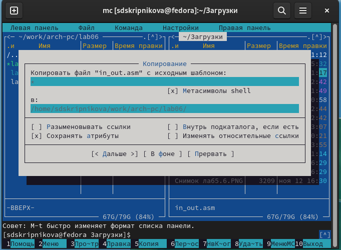{ #fig:009 width=70% }

3. Исправила текст программы в файле lab6-2.asm с использованием подпрограмм из внешнего файла in_out.asm. (рис. [-@fig:010])

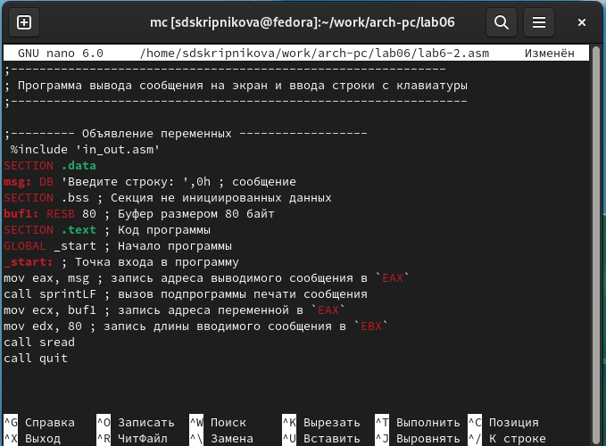{ #fig:010 width=70% }

4. Создала исполняемый файл lab6-2.asm и проверила его работу. (рис. [-@fig:011])

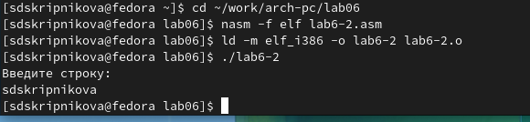{ #fig:011 width=70% }

5. В файле lab6-2.asm заменила подпрограмму sprintLF на sprint, проверила его работу. (рис. [-@fig:012])

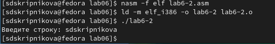{ #fig:012 width=70% }

Разница между подпрограммами sprintLF и sprint заключается в разном выводе результата. В подпрограмме sprintLF результат выводиться в 2 строки, а в подпрограмме sprint в одну.

## Задания для самостоятельной работы

1. Создала копию файла lab6-1.asm с названием lab6-1.1.asm, внесла изменения в программу, получила исполняемый файл и проверила его работу. (рис. [-@fig:013])

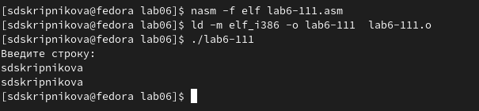{ #fig:013 width=70% }

2. Создала копию файла lab6-2.asm с названием lab6-22.asm, внесла изменения в программу, получила исполняемый файл и проверила его работу. (рис. [-@fig:014])

{ #fig:014 width=70% }

Данные изменения можно проверить по ссылке: [https://github.com/avobrezkova/study_2022-2023_arh-pc/tree/master/labs/lab06](https://github.com/avobrezkova/study_2022-2023_arh-pc/tree/master/labs/lab06)

# Выводы

Приобрела практические навыки работы в Midnight Commander. Освоила язык ассемблера mov и int.

# Список литературы{.unnumbered}

1. [https://esystem.rudn.ru/pluginfile.php/1584373/mod_resource/content/1/%D0%9B%D0%B0%D0%B1%D0%BE%D1%80%D0%B0%D1%82%D0%BE%D1%80%D0%BD%D0%B0%D1%8F%20%D1%80%D0%B0%D0%B1%D0%BE%D1%82%D0%B0%20%E2%84%966.pdf](https://esystem.rudn.ru/pluginfile.php/1584373/mod_resource/content/1/%D0%9B%D0%B0%D0%B1%D0%BE%D1%80%D0%B0%D1%82%D0%BE%D1%80%D0%BD%D0%B0%D1%8F%20%D1%80%D0%B0%D0%B1%D0%BE%D1%82%D0%B0%20%E2%84%966.pdf)

::: {#refs}
:::
