---
## Front matter
title: "ОТЧЕТ ПО ЛАБОРАТОРНОЙ РАБОТЕ №8"
subtitle: "Дисциплина: Архитектура компьютера"
author: "Скрипникова София Дмитриевна"

## Generic otions
lang: ru-RU
toc-title: "Содержание"

## Bibliography
bibliography: bib/cite.bib
csl: pandoc/csl/gost-r-7-0-5-2008-numeric.csl

## Pdf output format
toc: true # Table of contents
toc-depth: 2
lof: true # List of figures
lot: true # List of tables
fontsize: 12pt
linestretch: 1.5
papersize: a4
documentclass: scrreprt
## I18n polyglossia
polyglossia-lang:
  name: russian
  options:
	- spelling=modern
	- babelshorthands=true
polyglossia-otherlangs:
  name: english
## I18n babel
babel-lang: russian
babel-otherlangs: english
## Fonts
mainfont: PT Serif
romanfont: PT Serif
sansfont: PT Sans
monofont: PT Mono
mainfontoptions: Ligatures=TeX
romanfontoptions: Ligatures=TeX
sansfontoptions: Ligatures=TeX,Scale=MatchLowercase
monofontoptions: Scale=MatchLowercase,Scale=0.9
## Biblatex
biblatex: true
biblio-style: "gost-numeric"
biblatexoptions:
  - parentracker=true
  - backend=biber
  - hyperref=auto
  - language=auto
  - autolang=other*
  - citestyle=gost-numeric
## Pandoc-crossref LaTeX customization
figureTitle: "Рис."
tableTitle: "Таблица"
listingTitle: "Листинг"
lofTitle: "Список иллюстраций"
lotTitle: "Список таблиц"
lolTitle: "Листинги"
## Misc options
indent: true
header-includes:
  - \usepackage{indentfirst}
  - \usepackage{float} # keep figures where there are in the text
  - \floatplacement{figure}{H} # keep figures where there are in the text
---

# Цель работы

Изучение команд условного и безусловного переходов. Приобретение навыков написания программ с использованием переходов. Знакомство с назначением и структурой файла листинга.

# Задание

Изученить команды переходов. Приобрести навыки написания программ с использованием переходов. Ознакомится с назначением и структурой файла листинга.

# Теоретическое введение

Для реализации ветвлений в ассемблере используются так называемые команды передачи управления или команды перехода. Можно выделить 2 типа переходов:

• условный переход – выполнение или не выполнение перехода в определенную точку программы в зависимости от проверки условия.

• безусловный переход – выполнение передачи управления в определенную точку программы без каких-либо условий.

**Описание инструкции cmp**

Инструкция cmp является одной из инструкций, которая позволяет сравнить операнды и выставляет флаги в зависимости от результата сравнения.

Инструкция cmp является командой сравнения двух операндов и имеет такой же формат, как и команда вычитания:

cmp <операнд_1>, <операнд_2>

Команда cmp, так же как и команда вычитания, выполняет вычитание <операнд_2> - <операнд_1>, но результат вычитания никуда не записывается и единственным результатом команды сравнения является формирование
флагов.

**Команда условного перехода имеет вид**

j<мнемоника перехода> label

Мнемоника перехода связана со значением анализируемых флагов или со способом формирования этих флагов.

# Выполнение лабораторной работы

1. Создала каталог для программ лабораторной работы №8, перешла в него и создала файл lab8-1.asm. (рис. [-@fig:001])

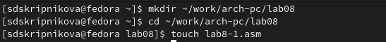{ #fig:001 width=70% }

2. Ввела в файл lab8-1 нужный текст программы из листинга 8.1., создала исполняемый файл и вывела результат. (рис. [-@fig:002])

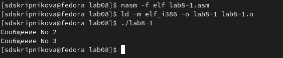{ #fig:002 width=70% }

3. Изменила текст программы в соответствии с листингом 8.2. (рис. [-@fig:003]; рис. [-@fig:004])

{ #fig:003 width=70% }

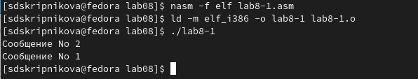{ #fig:004 width=70% }

4. Изменила текст программы, чтобы программа выводила определенный результат. (рис. [-@fig:006]; рис. [-@fig:007])

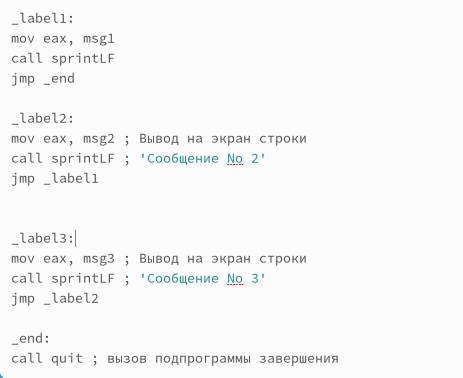{ #fig:005 width=70% }

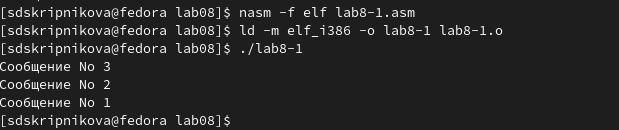{ #fig:006 width=70% }

5. Создала файл lab8-2.asm в нужном каталоге, ввела нужный текст и вывела результат. (рис. [-@fig:007]; рис. [-@fig:008]; рис. [-@fig:009])

{ #fig:007 width=70% }

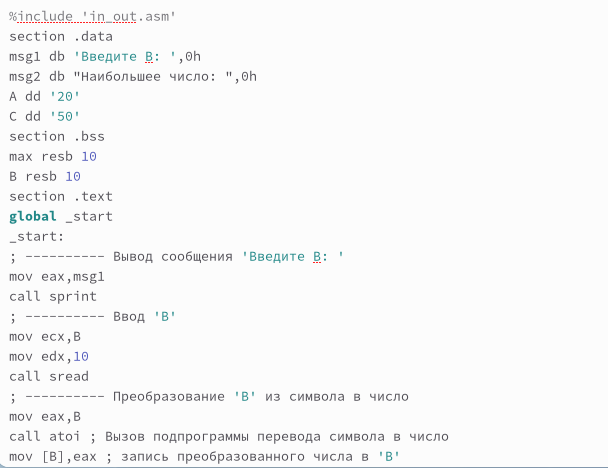{ #fig:008 width=70% }

{ #fig:009 width=70% }

6. Создала файл листинга для программы из файла lab8-2.asm, открыла созданный файл с помощью команды, ознакомилась с его форматом и содержимым. (рис. [-@fig:010]; рис. [-@fig:011])

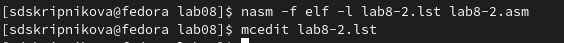{ #fig:010 width=70% }

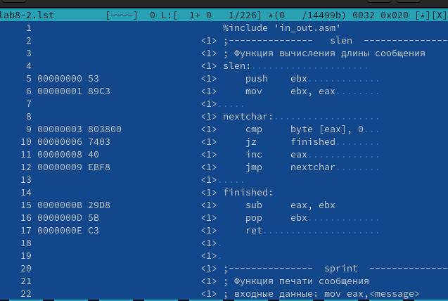{ #fig:011 width=70% }

7. Открыла файл с программой lab8-2.asm в инструкции с двумя операндами и удалила один операнд, выполнила трансляцию полученного файла листинга. (рис. [-@fig:012]; рис. [-@fig:013])

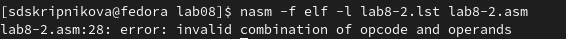{ #fig:012 width=70% }

{ #fig:013 width=70% }

Никаких выходных файлов не создается, так как постоянно возникает ошибка. Ошибка возникает из-за того, что в программе всегда должно быть два операнда, а  так как мы удаляем один операнд, программа не работает. В листинге добавляется строка с надписью error.

## Задания для самостоятельной работы

1. Я написала программу, которая находит наименьшее из 3 целочисленных переменных. (рис. [-@fig:014]; рис. [-@fig:015])

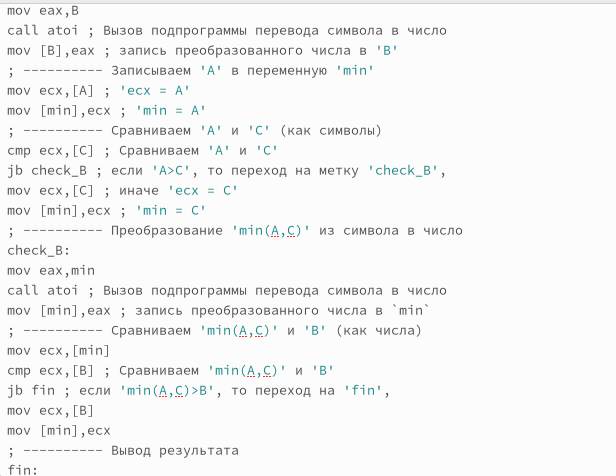{ #fig:014 width=70% }

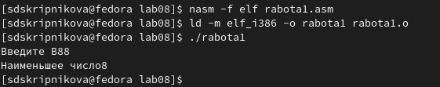{ #fig:015 width=70% }

2. Я написала программу, которая для введенных с клавиатуры значений вычислит значение заданной функции №6. (рис. [-@fig:016]; рис. [-@fig:017])

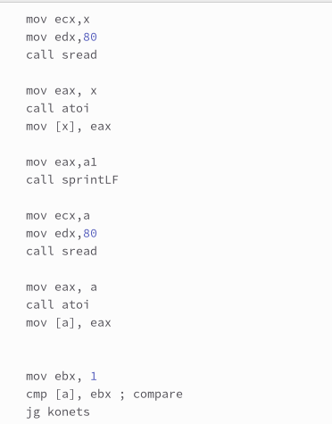{ #fig:016 width=70% }

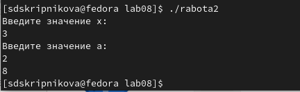{ #fig:017 width=70% }

Данные изменения можно проверить по ссылке: [https://github.com/sdskripnikova/study_2022-2023_arh-pc/tree/master/labs/lab08](https://github.com/sdskripnikova/study_2022-2023_arh-pc/tree/master/labs/lab08]
# Выводы

Изучила команды условного и безусловного переходов. Приобрела навыки написания программ с использованием переходов. Ознакомилась с назначением и структурой файла листинга..

# Список литературы{.unnumbered}

1. [https://esystem.rudn.ru/pluginfile.php/1584392/mod_resource/content/1/%D0%9B%D0%B0%D0%B1%D0%BE%D1%80%D0%B0%D1%82%D0%BE%D1%80%D0%BD%D0%B0%D1%8F%20%D1%80%D0%B0%D0%B1%D0%BE%D1%82%D0%B0%20%E2%84%968.pdf](https://esystem.rudn.ru/pluginfile.php/1584392/mod_resource/content/1/%D0%9B%D0%B0%D0%B1%D0%BE%D1%80%D0%B0%D1%82%D0%BE%D1%80%D0%BD%D0%B0%D1%8F%20%D1%80%D0%B0%D0%B1%D0%BE%D1%82%D0%B0%20%E2%84%968.pdf)

::: {#refs}
:::
