---
## Front matter
title: "Отчёт по лабораторной работе № 10"
subtitle: "Архитектура компьютера"
author: "Скрипникова София Дмитриевна"

## Generic otions
lang: ru-RU
toc-title: "Содержание"

## Bibliography
bibliography: bib/cite.bib
csl: pandoc/csl/gost-r-7-0-5-2008-numeric.csl

## Pdf output format
toc: true # Table of contents
toc-depth: 2
lof: true # List of figures
fontsize: 12pt
linestretch: 1.5
papersize: a4
documentclass: scrreprt
## I18n polyglossia
polyglossia-lang:
  name: russian
  options:
	- spelling=modern
	- babelshorthands=true
polyglossia-otherlangs:
  name: english
## I18n babel
babel-lang: russian
babel-otherlangs: english
## Fonts
mainfont: PT Serif
romanfont: PT Serif
sansfont: PT Sans
monofont: PT Mono
mainfontoptions: Ligatures=TeX
romanfontoptions: Ligatures=TeX
sansfontoptions: Ligatures=TeX,Scale=MatchLowercase
monofontoptions: Scale=MatchLowercase,Scale=0.9
## Biblatex
biblatex: true
biblio-style: "gost-numeric"
biblatexoptions:
  - parentracker=true
  - backend=biber
  - hyperref=auto
  - language=auto
  - autolang=other*
  - citestyle=gost-numeric
## Pandoc-crossref LaTeX customization
figureTitle: "Рис."
tableTitle: "Таблица"
listingTitle: "Листинг"
lofTitle: "Список иллюстраций"
lolTitle: "Листинги"
## Misc options
indent: true
header-includes:
  - \usepackage{indentfirst}
  - \usepackage{float} # keep figures where there are in the text
  - \floatplacement{figure}{H} # keep figures where there are in the text
---

# Цель работы

Приобретение навыков написания программ с использованием подпрограмм.
Знакомство с методами отладки при помощи GDB и его основными возможностями.

# Задание

1. Реализовать подпрограммы в NASM.
2. Выполнить отладку программам с помощью GDB.
3. Отработать добавление точек останова.
4. Поработа с данными программы в GDB.
5. Отработать обработку аргументов командной строки в GDB.
6. Выполнить задание для самостоятельной работы.

# Выполнение лабораторной работы

## Реализация подпрограмм в NASM
1. Создали каталог для выполнения лабораторной работы № 10, перешли
в него и создали файл lab10-1.asm: (рис. [-@fig:001])

{ #fig:001 width=70% }

2. В качестве примера рассмотрели программу вычисления арифметического
выражения f(x) = 2x + 7 с помощью подпрограммы _calcul. В данном
примере x вводится с клавиатуры, а само выражение вычисляется в подпрограмме. Внимательно изучили текст программы (Листинг 10.1).

Введите в файл lab10-1.asm текст программы из листинга 10.1. (рис. [-@fig:002])
Создайте исполняемый файл и проверьте его работу.(рис. [-@fig:003])

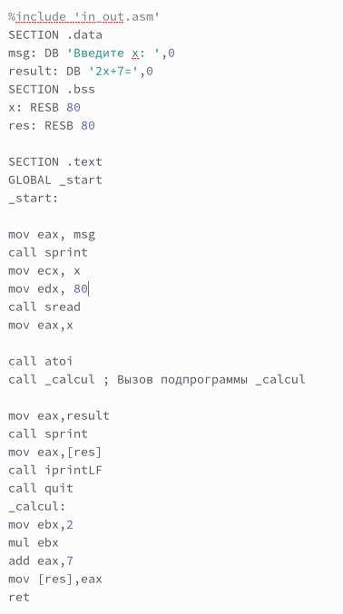{ #fig:002 width=70% }

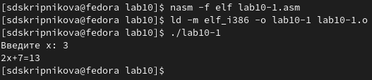{ #fig:003 width=70% }

Изменили текст программы, добавив подпрограмму _subcalcul в подпрограмму _calcul, для вычисления выражения f(g(x)), где x вводится с клавиатуры, f(x) = 2x + 7, g(x) = 3x − 1. Т.е. x передается в подпрограмму _calcul из нее
в подпрограмму _subcalcul, где вычисляется выражение g(x), результат возвращается в _calcul и вычисляется выражение f(g(x)). Результат возвращается
в основную программу для вывода результата на экран. (рис. [-@fig:004]), (рис. [-@fig:005])

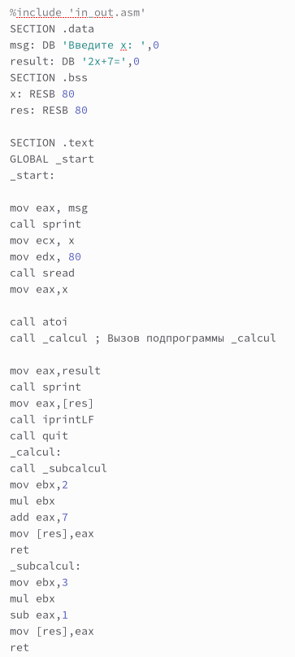{ #fig:004 width=70% }

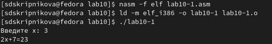{ #fig:005 width=70% }

## Отладка программам с помощью GDB
Создали файл lab10-2.asm с текстом программы из Листинга 10.2. (Программа печати сообщения Hello world!): (рис. [-@fig:006]), (рис. [-@fig:007])

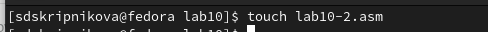{ #fig:006 width=70% }

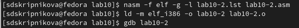{ #fig:007 width=70% }

Получили исполняемый файл. Для работы с GDB в исполняемый файл добавили отладочную информацию, для этого трансляцию программ
провели с ключом ‘-g’.Загрузили исполняемый файл в отладчик gdb.(рис. [-@fig:008])

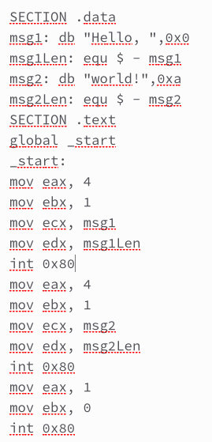{ #fig:008 width=70% }

Загрузили исполняемый файл в отладчик gdb.
Проверили работу программы, запустив ее в оболочке GDB с помощью команды run (сокращённо r):(рис. [-@fig:009])

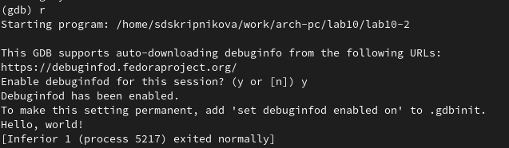{ #fig:009 width=70% }

Для более подробного анализа программы установили брейкпоинт на метку
_start, с которой начинается выполнение любой ассемблерной программы, и
запустили её.(рис. [-@fig:010])

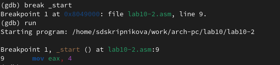{ #fig:010 width=70% }

Посмотрели дисассимилированный код программы с помощью команды
disassemble начиная с метки _start. (рис. [-@fig:011])

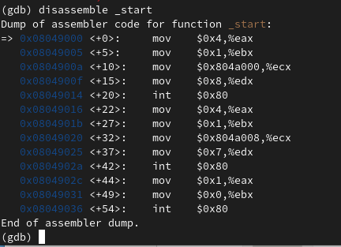{ #fig:011 width=70% }

Переключились на отображение команд с Intel’овским синтаксисом, введя
команду set disassembly-flavor intel. (рис. [-@fig:012])

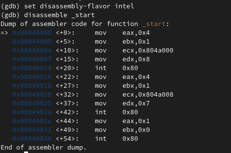{ #fig:012 width=70% }

Различия отображения синтаксиса машинных команд в режимах
ATT и Intel: в АТТ перед адресом регистра ставится $, а перед названием регистра %, сначала записывается адрес, а потом - регистр. В Intel сначала регистр, а потом адрес, и перед ними ничего не ставится.

Включили режим псевдографики для более удобного анализа программы.(рис. [-@fig:013])

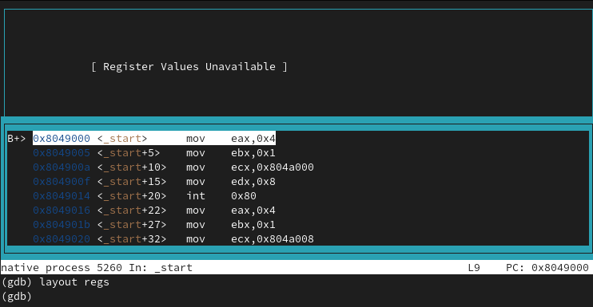{ #fig:013 width=70% }

## Добавление точек останова
Установить точку останова можно командой break (кратко b). Типичный аргумент этой команды — место установки. Его можно задать или как номер строки
программы (имеет смысл, если есть исходный файл, а программа компилировалась с информацией об отладке), или как имя метки, или как адрес. Чтобы не
было путаницы с номерами, перед адресом ставится «звёздочка»:
На предыдущих шагах была установлена точка останова по имени метки
(_start). Проверили это с помощью команды info breakpoints (кратко i b). (рис. [-@fig:014])

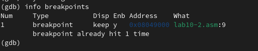{ #fig:014 width=70% }

Установили еще одну точку останова по адресу инструкции. Адрес инструкции увидели в средней части экрана в левом столбце соответствующей
инструкции. Определили адрес предпоследней инструкции (mov
ebx,0x0) и установили точку останова. (рис. [-@fig:015])

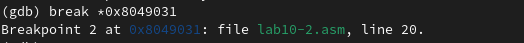{ #fig:015 width=70% }

Посмотрели информацию о всех установленных точках останова: (рис. [-@fig:016])

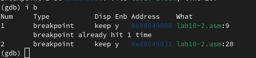{ #fig:016 width=70% }

## Работа с данными программы в GDB
Отладчик может показывать содержимое ячеек памяти и регистров, а при
необходимости позволяет вручную изменять значения регистров и переменных.
Выполнили 5 инструкций с помощью команды stepi (или si) и проследили за
изменением значений регистров. (рис. [-@fig:017]))

{ #fig:017 width=70% }

Изменяются значения регистров: eax, ecx, edx, ebx.

Посмотрели содержимое регистров с помощью команды info
registers (или i r). (рис. [-@fig:018])

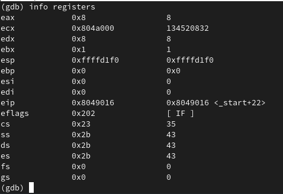{ #fig:018 width=70% }

Для отображения содержимого памяти можно использовать команду x
<адрес>, которая выдаёт содержимое ячейки памяти по указанному адресу.
Формат, в котором выводятся данные, можно задать после имени команды
через косую черту: x/NFU <адрес>.
С помощью команды x &<имя переменной> также можно посмотреть содержимое переменной.
Посмотрели значение переменной msg1 по имени. (рис. [-@fig:019])

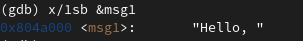{ #fig:019 width=70% }

Посмотрели значение переменной msg2 по адресу. Адрес переменной
определили по дизассемблированной инструкции. Посмотрели инструкцию mov
ecx,msg2 которая записывает в регистр ecx адрес перемененной msg2. (рис. [-@fig:020])

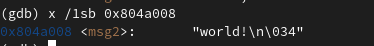{ #fig:020 width=70% }

Изменить значение для регистра или ячейки памяти можно с помощью команды set, задав ей в качестве аргумента имя регистра или адрес. При этом
перед именем регистра ставится префикс $, а перед адресом нужно указать
в фигурных скобках тип данных. Изменили первый символ
переменной msg1. (рис. [-@fig:021])

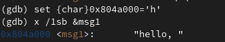{ #fig:021 width=70% }

Замените первый символ во второй переменной msg2. (рис. [-@fig:022])

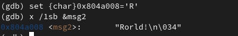{ #fig:022 width=70% }

Чтобы посмотреть значения регистров используется команда print /F <val>.
Вывели в различных форматах (в шестнадцатеричном формате, в двоичном
формате и в символьном виде) значение регистра edx. (рис. [-@fig:023])

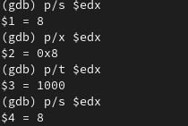{ #fig:023 width=70% }

С помощью команды set измените значение регистра ebx: (рис. [-@fig:024])

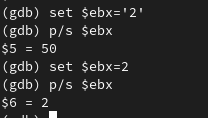{ #fig:024 width=70% }

Разница вывода комманд p/s $ebx:

Завершили выполнение программы с помощью команды continue (сокращенно c) и вышли из GDB с помощью команды
quit (сокращенно q). (рис. [-@fig:025]), (рис. [-@fig:026])

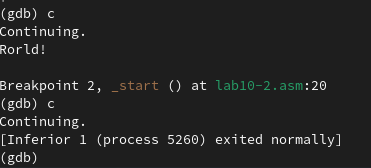{ #fig:025 width=70% }

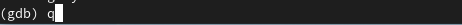{ #fig:026 width=70% }

## Обработка аргументов командной строки в GDB
Скопировали файл lab9-2.asm, созданный при выполнении лабораторной работы №9, с программой выводящей на экран аргументы командной строки
(Листинг 9.2) в файл с именем lab10-3.asm: (рис. [-@fig:027])

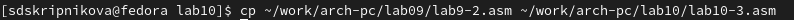{ #fig:027 width=70% }

Создали исполняемый файл. (рис. [-@fig:028])

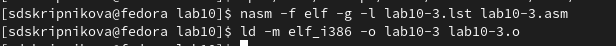{ #fig:028 width=70% }

Для загрузки в gdb программы с аргументами необходимо использовать ключ
--args. Загрузили исполняемый файл в отладчик, указав аргументы: (рис. [-@fig:029])

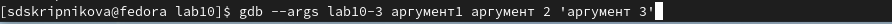{ #fig:029 width=70% }

Как отмечалось в предыдущей лабораторной работе, при запуске программы
аргументы командной строки загружаются в стек. Исследовали расположение
аргументов командной строки в стеке после запуска программы с помощью
gdb.
Для начала установили точку останова перед первой инструкцией в программе
и запустили ее. (рис. [-@fig:030])

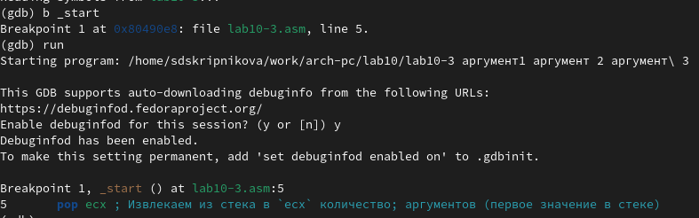{ #fig:030 width=70% }

Адрес вершины стека храниться в регистре esp и по этому адресу располагается число равное количеству аргументов командной строки (включая имя
программы): (рис. [-@fig:031])

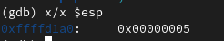{ #fig:031 width=70% }

Как видно, число аргументов равно 5 – это имя программы lab10-3 и непосредственно аргументы: аргумент1, аргумент, 2 и 'аргумент 3'.
Посмотрели остальные позиции стека – по адесу [esp+4] располагается адрес
в памяти где находиться имя программы, по адесу [esp+8] храниться адрес
первого аргумента, по аресу [esp+12] – второго и т.д. (рис. [-@fig:032])

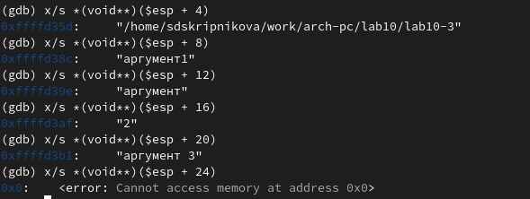{ #fig:032 width=70% }

Шаг изменения адреса равен 4 ([esp+4], [esp+8], [esp+12]
и т.д.), потому что в теле цикла 4 строки кода.

## Задание для самостоятельной работы
1. Преобразовали программу из лабораторной работы №9 (Задание №1 для
самостоятельной работы), реализовав вычисление значения функции f(x)
как подпрограмму. (рис. [-@fig:033]), (рис. [-@fig:034]), (рис. [-@fig:035])

{ #fig:033 width=70% }

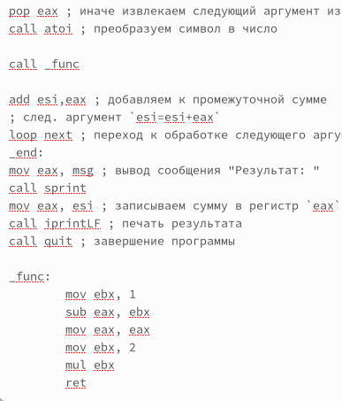{ #fig:034 width=70% }

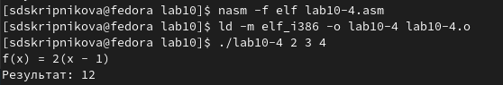{ #fig:035 width=70% }

2. В листинге 10.3 приведена программа вычисления выражения (3 + 2) ∗ 4 + 5. 

Создали файл (рис. [-@fig:036]), записали туда код листинга (рис. [-@fig:037]), создали исполняющий файл (рис. [-@fig:038]), при запуске обнаружили вывод неверного результата (рис. [-@fig:039]).

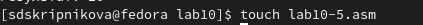{ #fig:036 width=70% }

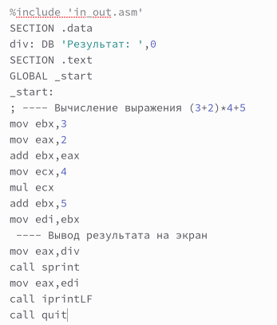{ #fig:037 width=70% }

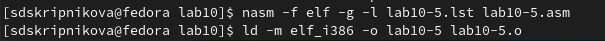{ #fig:038 width=70% }

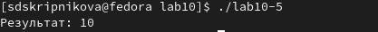{ #fig:039 width=70% }

Запустили файл в отладчике GDB (рис. [-@fig:040]), установили точку останова (рис. [-@fig:041]), запустили код (рис. [-@fig:042]), включили режим псевдографики (рис. [-@fig:043]), пошагово прошли все строчки кода (рис. [-@fig:044]), (рис. [-@fig:045]),(рис. [-@fig:046]), (рис. [-@fig:047]), (рис. [-@fig:048]), (рис. [-@fig:049]), (рис. [-@fig:050]), (рис. [-@fig:051]), обнаружили ошибку: вместо регистра ebx на 4 умножался eax, а 5 прибавлялась не к произведению, а только к ebx, исправили её (рис. [-@fig:052]), проверили результат работы программы (рис. [-@fig:053]).

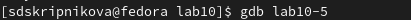{ #fig:040 width=70% }

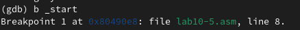{ #fig:041 width=70% }

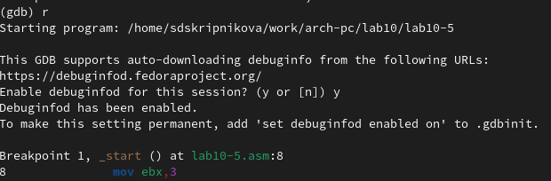{ #fig:042 width=70% }

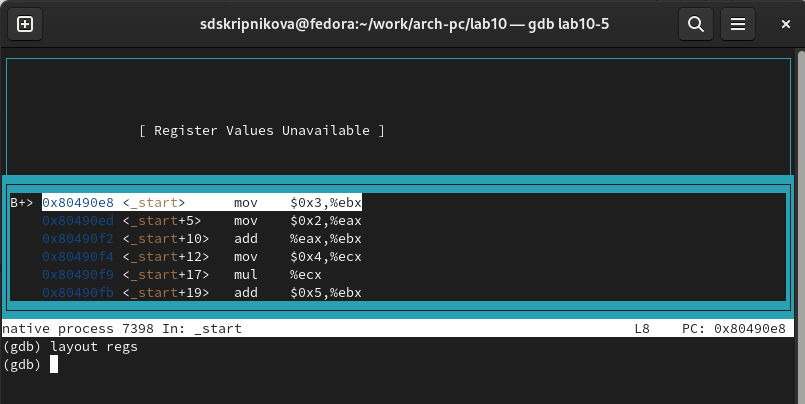{ #fig:043 width=70% }

{ #fig:044 width=70% }

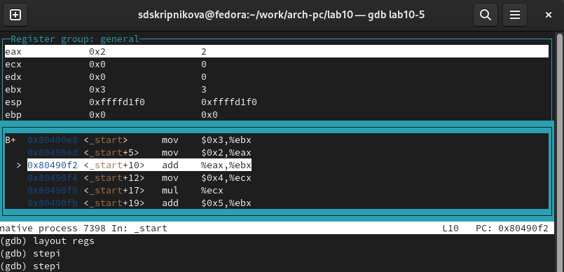{ #fig:045 width=70% }

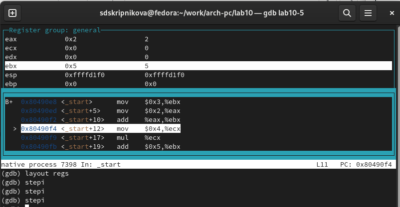{ #fig:046 width=70% }

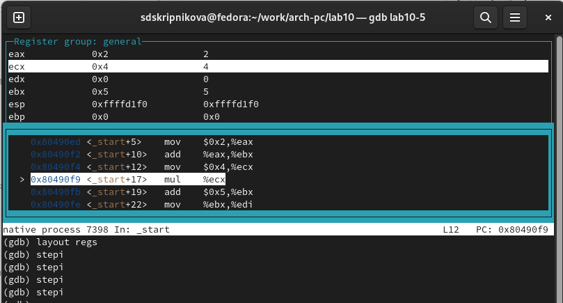{ #fig:047 width=70% }

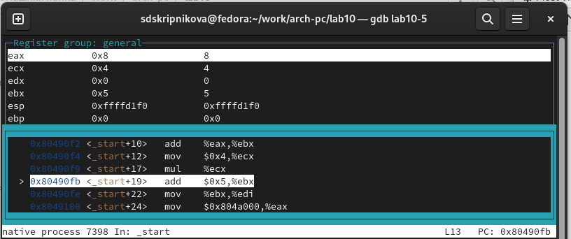{ #fig:048 width=70% }

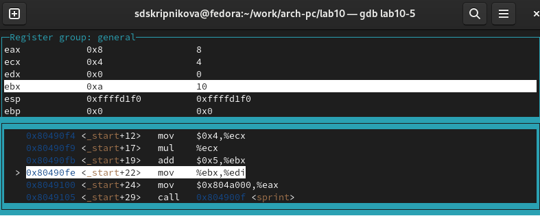{ #fig:049 width=70% }

{ #fig:050 width=70% }

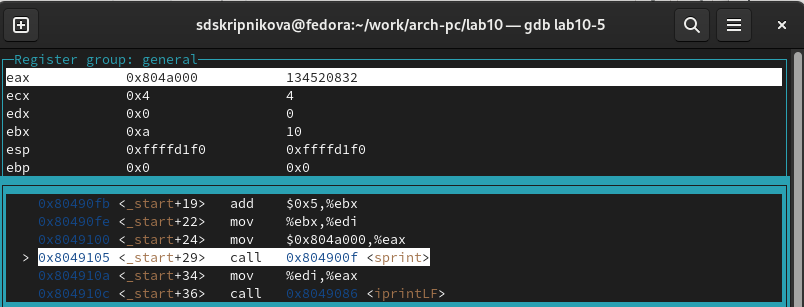{ #fig:051 width=70% }

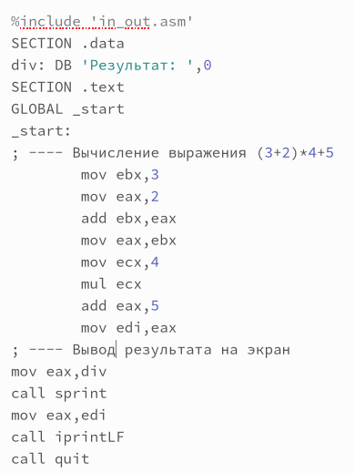{ #fig:052 width=70% }

{ #fig:053 width=70% }

# Выводы

В ходе выполнения лабораторной работы были приобретены навыки написания программ с использованием подпрограмм, ознакомились с методами отладки при помощи GDB и его основными возможностями.

::: {#refs}
:::
