---
## Front matter
title: "Отчёт по лабораторной работе № 11"
subtitle: "Архитектура компьютера"
author: "Скрипникова София"

## Generic otions
lang: ru-RU
toc-title: "Содержание"

## Bibliography
bibliography: bib/cite.bib
csl: pandoc/csl/gost-r-7-0-5-2008-numeric.csl

## Pdf output format
toc: true # Table of contents
toc-depth: 2
lof: true # List of figures
fontsize: 12pt
linestretch: 1.5
papersize: a4
documentclass: scrreprt
## I18n polyglossia
polyglossia-lang:
  name: russian
  options:
	- spelling=modern
	- babelshorthands=true
polyglossia-otherlangs:
  name: english
## I18n babel
babel-lang: russian
babel-otherlangs: english
## Fonts
mainfont: PT Serif
romanfont: PT Serif
sansfont: PT Sans
monofont: PT Mono
mainfontoptions: Ligatures=TeX
romanfontoptions: Ligatures=TeX
sansfontoptions: Ligatures=TeX,Scale=MatchLowercase
monofontoptions: Scale=MatchLowercase,Scale=0.9
## Biblatex
biblatex: true
biblio-style: "gost-numeric"
biblatexoptions:
  - parentracker=true
  - backend=biber
  - hyperref=auto
  - language=auto
  - autolang=other*
  - citestyle=gost-numeric
## Pandoc-crossref LaTeX customization
figureTitle: "Рис."
tableTitle: "Таблица"
listingTitle: "Листинг"
lofTitle: "Список иллюстраций"
lolTitle: "Листинги"
## Misc options
indent: true
header-includes:
  - \usepackage{indentfirst}
  - \usepackage{float} # keep figures where there are in the text
  - \floatplacement{figure}{H} # keep figures where there are in the text
---

# Цель работы

Приобретение навыков написания программ для работы с файлами.

# Задание

1. Отработать запись данных в файл.
2. отработать изменение прав доступа к файлам.
3. Выполнить задание для самостоятельной работы.

# Выполнение лабораторной работы

1. Создали каталог для программам лабораторной работы № 11, перешли
в него и создали файл lab11-1.asm и readme.txt (рис. [-@fig:001])

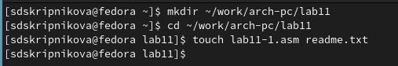{ #fig:001 width=70% }

2. Ввели в файл lab11-1.asm текст программы из листинга 11.1 (Программа
записи в файл сообщения). Создали исполняемый файл и проверили его
работу. рис. [-@fig:002]), рис. [-@fig:003]), рис. [-@fig:004])

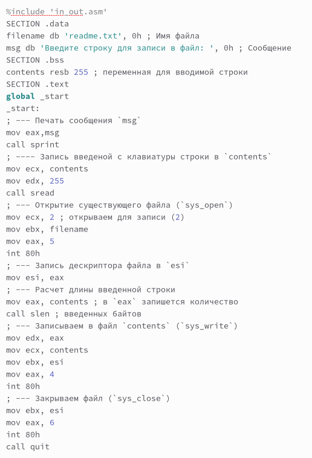{ #fig:002 width=70% }

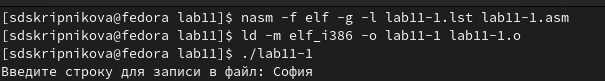{ #fig:003 width=70% }

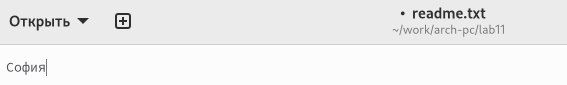{ #fig:004 width=70% }

3. С помощью команды chmod изменили права доступа к исполняемому файлу
lab11-1, запретив его выполнение. Попытались выполнить файл и получили следующий результат, так как выполнение файла ограничено. рис. [-@fig:005]), рис. [-@fig:006])

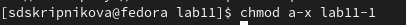{ #fig:005 width=70% }

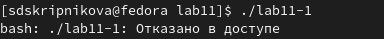{ #fig:006 width=70% }

4. С помощью команды chmod изменили права доступа к файлу lab11-1.asm с
исходным текстом программы,добавив права на исполнение. Выполнили его, так как вернули права на исполнение. рис. [-@fig:007]), рис. [-@fig:008])

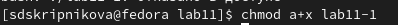{ #fig:007 width=70% }

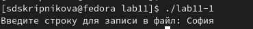{ #fig:008 width=70% }

5. Предоставили права доступа к файлу readme.txt в соответствии с 4 вариантом в таблице 11.4.рис. Проверили правильность выполнения с помощью
команды ls -l. рис. [-@fig:009])

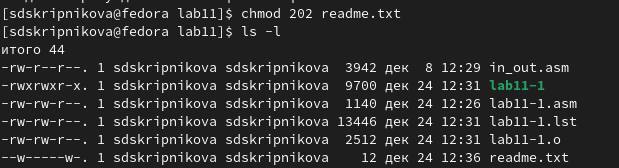{ #fig:009 width=70% }

## Задание для самостоятельной работы

1. Написали программу работающую по следующему алгоритму рис. [-@fig:010]), рис. [-@fig:011]).
• Вывод приглашения “Как Вас зовут?”.
• ввести с клавиатуры свои фамилию и имя.
• создать файл с именем name.txt.
• записать в файл сообщение “Меня зовут”.
• дописать в файл строку введенную с клавиатуры.
• закрыть файл.

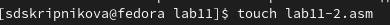{ #fig:010 width=70% }

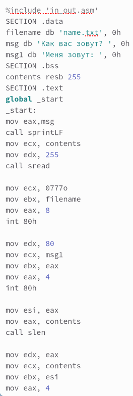{ #fig:011 width=70% }

Создали исполняемый файл и проверили его работу. Проверили наличие файла
и его содержимое с помощью команд ls и cat. рис. [-@fig:012])

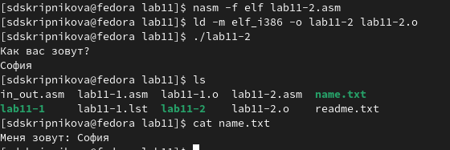{ #fig:012 width=70% }

# Выводы

В ходе выполнения лабораторной работы были приобретены навыки написания программ для работы с файлами.

::: {#refs}
:::
